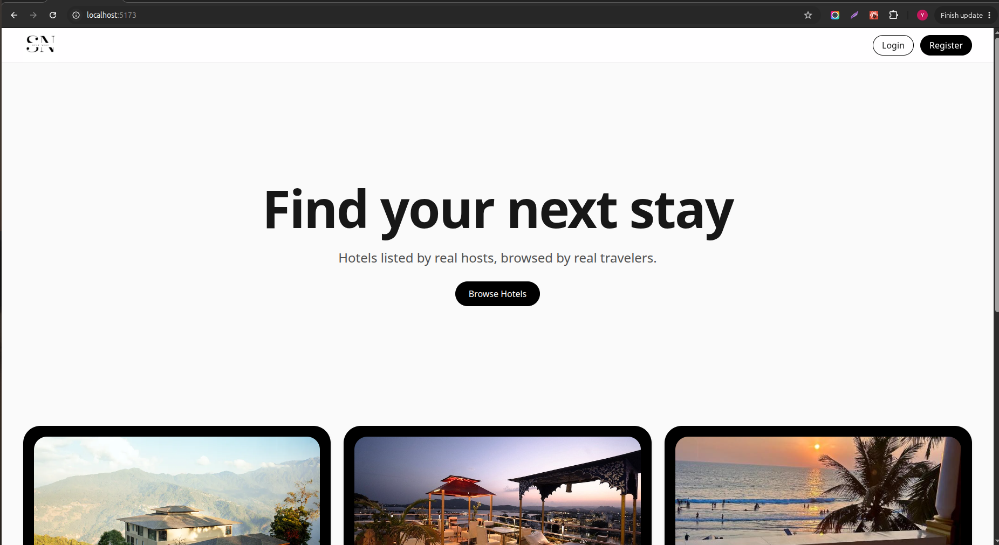
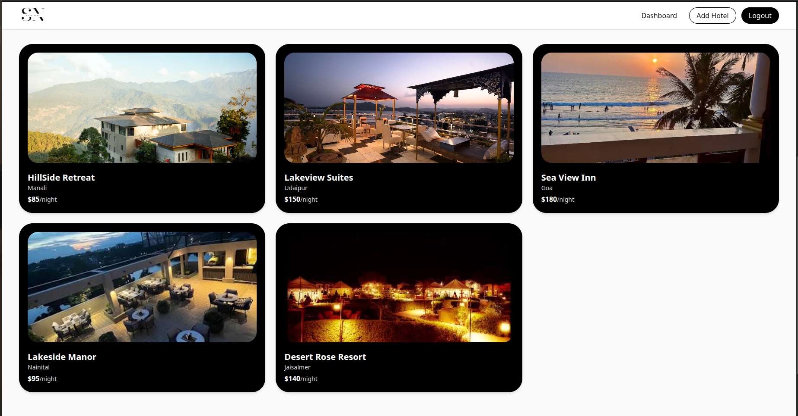
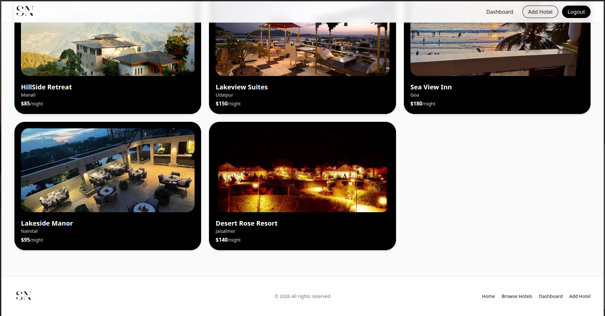
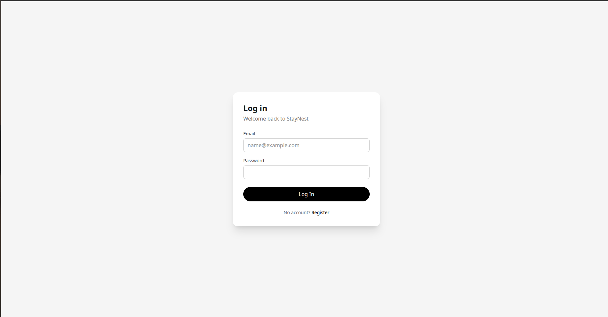
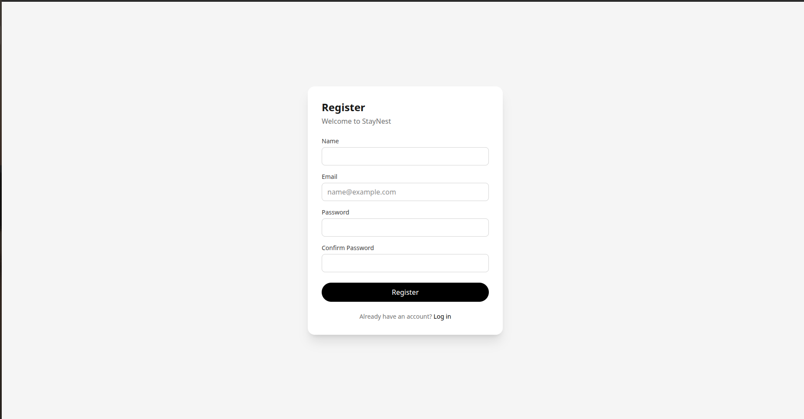
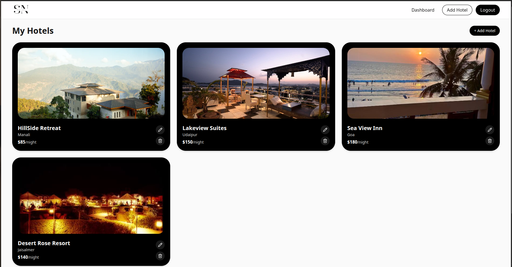
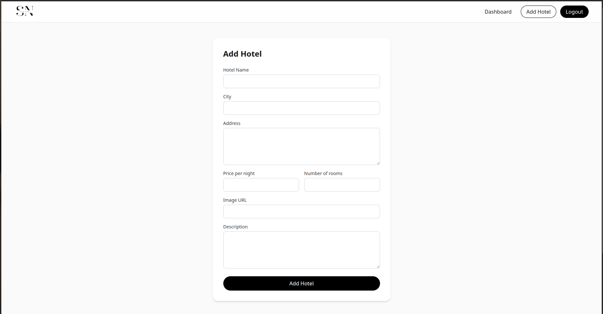
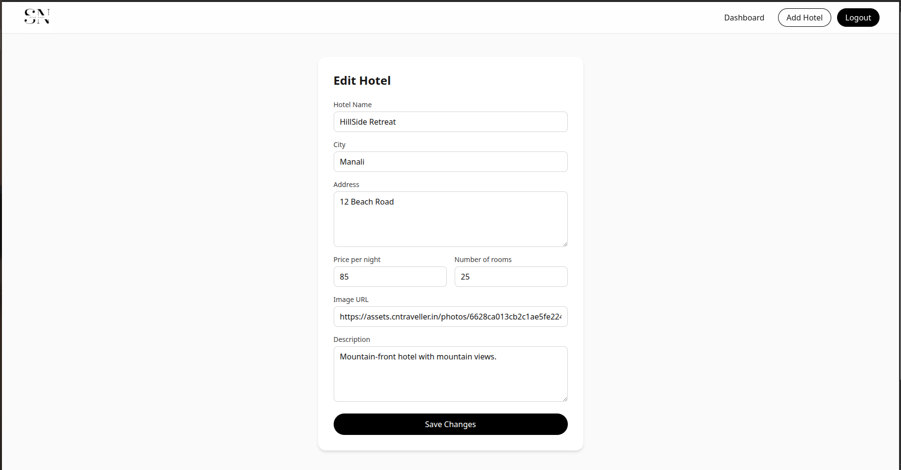

# StayNest

A hotel listing website built as a frontend assignment. Users can register, log in, browse hotels, and manage their own listings (add, edit, delete) from a dashboard.

The backend API is provided separately and is not part of this repository.

## Tech Stack

- **React + Vite** — functional components and hooks
- **TypeScript**
- **Tailwind CSS** — all styling
- **React Query (TanStack Query)** — all API calls (`useQuery` for reads, `useMutation` for writes)
- **React Hook Form** — all forms, with validation and error messages
- **React Router** — routing, including a protected-route wrapper for private pages

## Features

- Register and log in with a JWT returned by the API, stored so the session survives a page refresh
- Landing page listing every hotel, with loading, error and empty states
- Dashboard showing only the logged-in user's own hotels
- Add and Edit hotel, sharing one form component and its validation
- Delete a hotel, with a confirmation dialog before the request is sent
- Private pages (`/dashboard` and its sub-routes) redirect to `/login` when logged out
- Responsive layout for mobile, tablet and desktop

## Getting Started

### Prerequisites

- Node.js 20 or newer
- The StayNest backend API running locally (see its own README for setup)

### Installation

```bash
git clone <repo-url>
cd staynest
npm install
```

### Environment Variables

Create a `.env` file in the project root:

```
VITE_API_BASE_URL=http://localhost:4000
```

Set this to wherever the backend is running. Vite only exposes variables prefixed with `VITE_`, and the dev server needs a restart after changing this file.

### Run the backend

Start the provided backend API separately, and make sure its `CORS_ORIGIN` allows this app's origin (`http://localhost:5173` by default for Vite).

### Run the frontend

```bash
npm run dev
```

The app runs at `http://localhost:5173`.

## Routes

| Path                  | Access  | Description                     |
| --------------------- | ------- | ------------------------------- |
| `/`                   | Public  | Landing page with all hotels    |
| `/login`              | Public  | Login form                      |
| `/register`           | Public  | Registration form               |
| `/dashboard`          | Private | The logged-in user's own hotels |
| `/dashboard/add`      | Private | Add a new hotel                 |
| `/dashboard/edit/:id` | Private | Edit an existing hotel          |

Private routes redirect to `/login` if there is no logged-in user.

## Screenshots

Landing Page




Login Page


Register Page


Dahboard Page


Add Hotel Page


Edit Hotel Page

